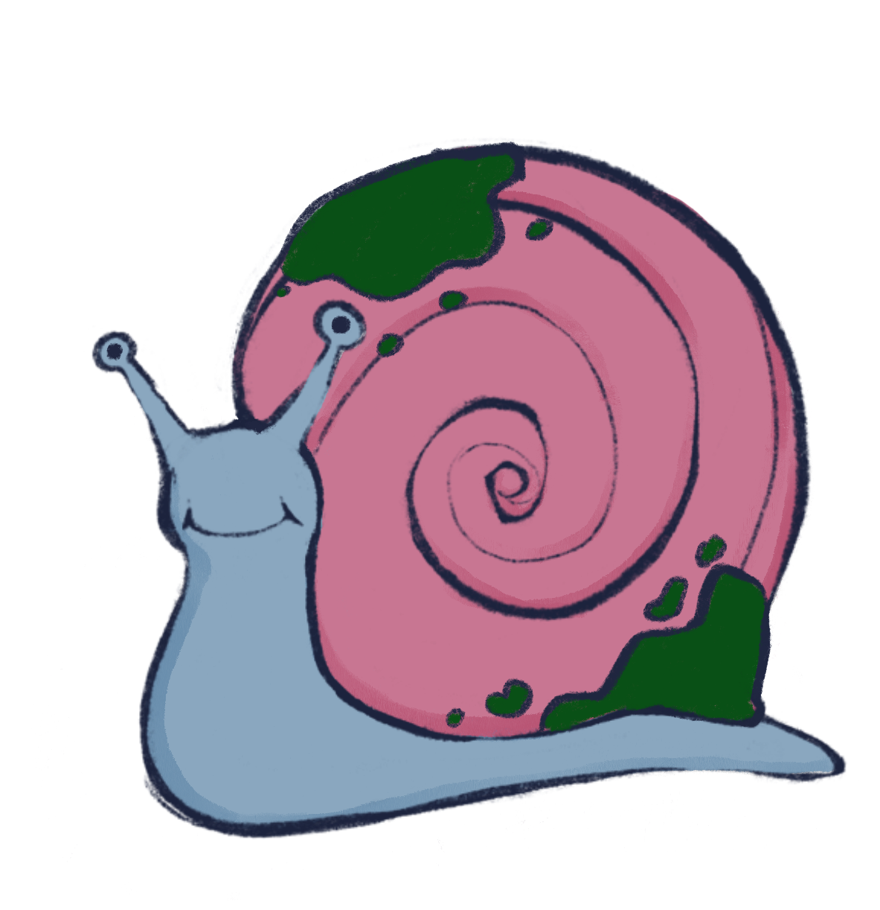
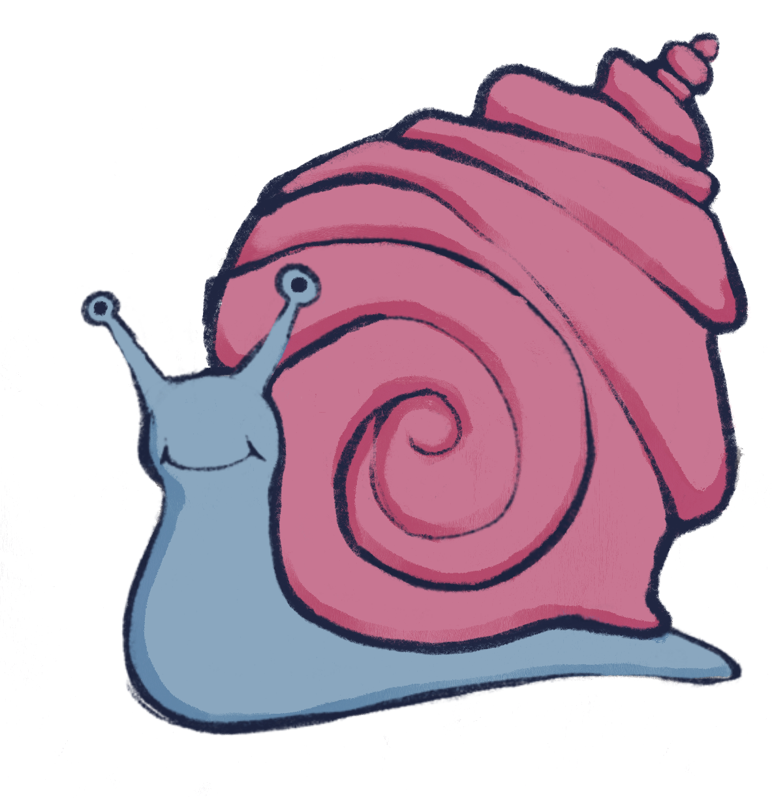
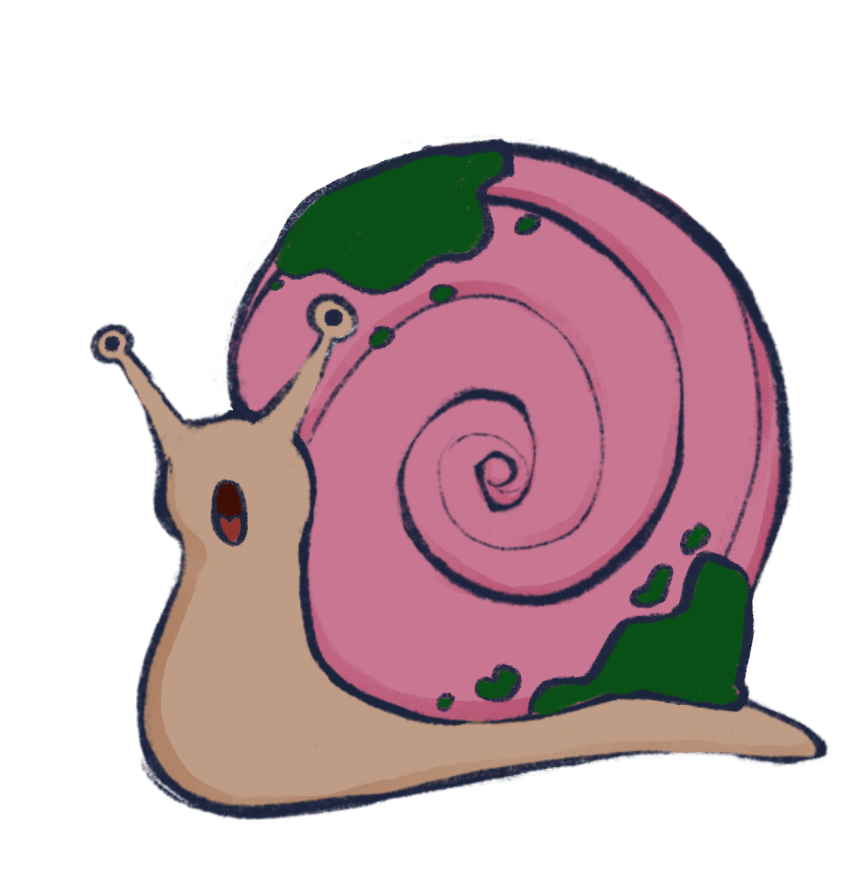
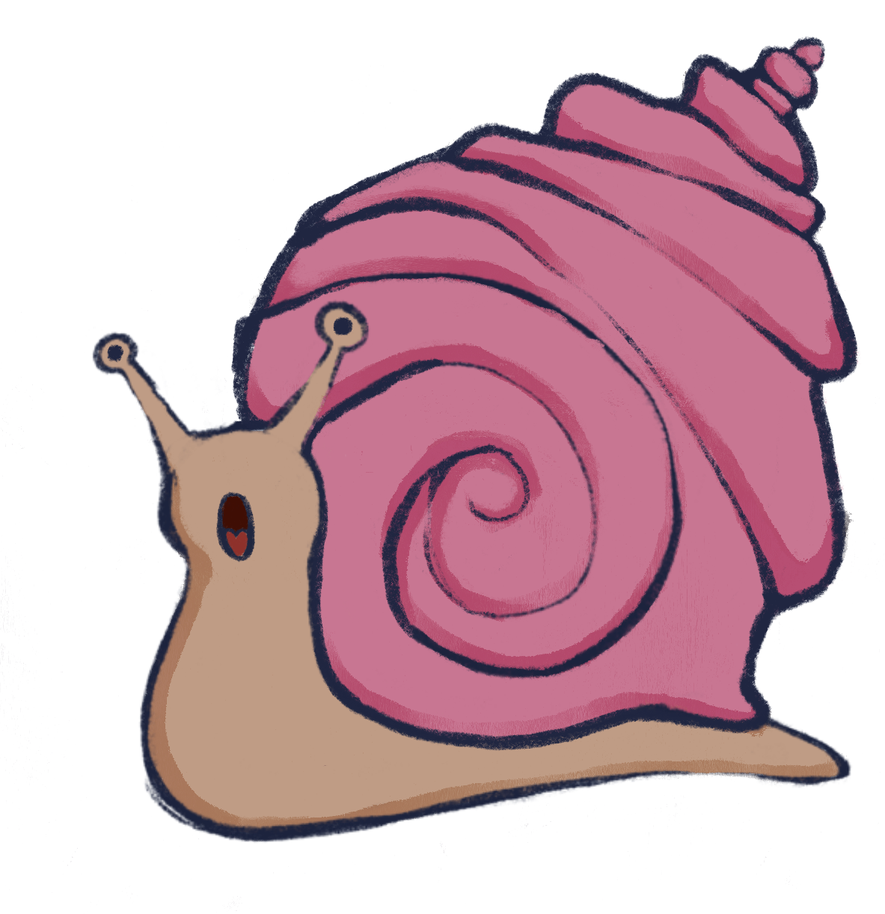
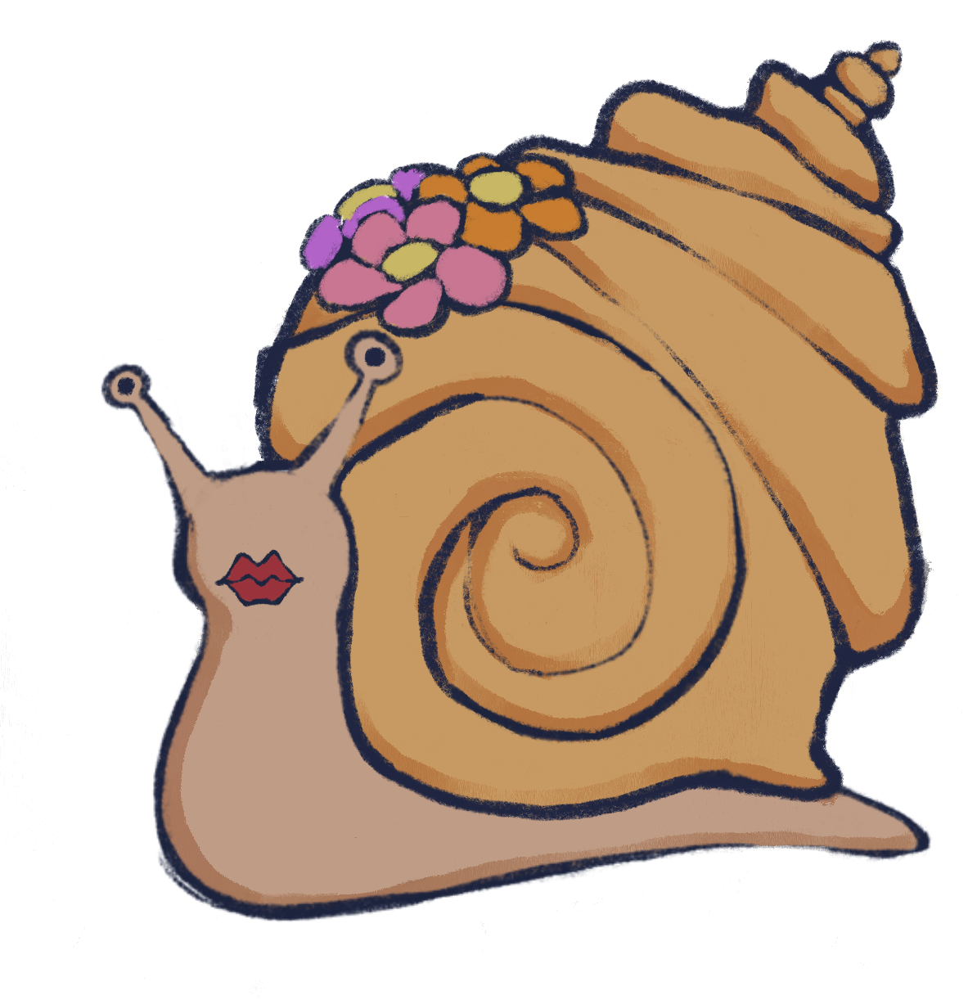

# 🐌 Speedy Snailing

Welcome to **Speedy Snailing**, a whimsical idle breeding game where you collect, breed, and observe genetically unique snails in a cozy, fairy-garden-inspired habitat. Each snail has its own blend of traits, stats, and personality... from the noble Bill Sir Slimesworth to the mysterious Glerb to the ever-cool Dribble McSlide.

#### This project's current features:
- A <b> genetic algorithm </b> for breeding snails with inherited and rare mutated traits
- <b>Supabase/PostgreSQL</b> backend for storing snails and traits
- React frontend with core interactions like <b> hunting </b> and <b>breeding </b>
- Dynamic <b>image compositing</b> to render unique snails based on their traits
- <b> Interactions </b> for hunting and breeding snails.

---

## Tech Stack

- Backend: 
    - JavaScript
    - Express
    - PostgreSQL
- Frontend: 
    - React
    - Vite
    - CSS
- Image Rendering: Sharp (Node.js image processing)
- State: Supabase real-time storage

---
## Getting Started

### Requirements

- Node.js `v18+`
- PostgreSQL (via Supabase)
- npm (or yarn)

---

### Project Structure
```
SpeedySnailing/ 
├── client/ # Frontend (React + Vite + CSS) 
│   ├── public/ 
│   │   └── vite.svg 
│   ├── src/ 
│   │   ├── assets/ # Frontend assets (images, components, etc.) 
│   │   ├── App.css 
│   │   ├── App.jsx 
│   │   ├── index.css 
│   │   ├── main.jsx 
│   │   └── styles.css 
│   ├── index.html 
│   ├── package.json 
│   └── vite.config.js
├── server/ # Backend (Express + Supabase + Postgres) 
│   ├── assets/ # Private image trait layers for snail rendering 
│   ├── config/ 
│   │   └── supabaseClient.js 
│   ├── controllers/ 
│   │   └── snailController.js 
│   ├── db/ 
│   │   ├── db.js 
│   │   ├── index.js 
│   │   └── queries.js 
│   ├── routes/ 
│   │   └── snails.js 
│   ├── utils/ 
│   │   ├── createRandomSnail.js 
│   │   ├── generateSnailName.js 
│   │   ├── geneticAlgorithm.js 
│   │   └── snailNames.js 
│   ├── .env 
│   ├── .env.example 
│   ├── package.json 
│   ├── package-lock.json
│   ├── .gitignore 
│   ├── server.js # Entry point 
│   ├── testConnection.js 
│   └── testEnv.js
├── README.md 
├── Schema.sql
├── package.json 
└── package-lock.json
```
---

## 🧪 Setup Instructions

### 1. Clone the project

```bash
git clone https://github.com/Brynna-M/speedy-snailing.git
cd speedy-snailing
```

### 2. Install backend dependencies

```bash
cd server
npm install
```
### 3. Set up Supabase
Go to Supabase and creat a free account
Create the databases outlined in the SQL schema

### 4. Create a .env file with your Supabase credentials:
SUPABASE_URL=your-url
SUPABASE_KEY=your-anon-key

### 5. then run 
```bash
npm run dev
# or
node server.js
```
### 6. Install frontend dependencies
```bash
cd ../client
npm install
npm run dev
```

## Snail Details
Each snail has:
- Traits (e.g., shell shape, color, eyes, accessories)
- Stats (speed, slimeiness, charisma)
- Genetic Traits (e.g., hoarder, glows_in_the_dark)
- Custom Names (generated or user-assigned)

## Example Snails

### Wild Snails 
<b>Generated randomly</b>

<div style="display: flex; flex-wrap: wrap; gap: 2rem; align-items: center; justify-content: center;">

  <div style="text-align: center;">
    
    <p>Sludge of Gloam</p>
  </div>

  <div style="text-align: center;">
    
    <p>Snibble von Slime</p>
  </div>

  <div style="text-align: center;">
    
    <p>Dribble Napshell</p>
  </div>

  <div style="text-align: center;">
    
    <p>Bop Cuddleflap</p>
  </div>

</div>

---

### Child Snails 
<b>Generated using the genetic algorithm</b>

<div style="display: flex; flex-wrap: wrap; gap: 2rem; align-items: center; justify-content: center;">

  <div style="text-align: center;">
    
    <p>Child of Dribble Napshell + Bop Cuddleflap (no mutations)</p>
  </div>

  <div style="text-align: center;">
    
    <p>Child of Dribble Napshell + Bop Cuddleflap (mutated)</p>
  </div>

</div>

## Road Map
#### Phase 1: The Basics – Laying the Groundwork [Completed]
- [x] A genetic algorithm for breeding snails with inherited and rare mutated traits
- [x] Supabase/PostgreSQL backend for storing snails and traits
- [x] React frontend with core interactions like hunting and breeding
- [x] Dynamic image compositing to render unique snails based on their traits
- [x] Interactions for hunting and breeding snails.

#### Phase 2: Home Sweet Habitat – User Features & Beautification [In progress]
- [-] Redesign frontend into a cozy, woodsy snail habitat
- [ ] Implement player profiles with Google OAuth login
- [-] Allow users to rename snails from the frontend
- [ ] Add collection tracking and user-specific snail stats
- [ ] Add habitat stats and states (e.g., cleanliness, temperature)
- [ ] Use habitat states to influence snail emotions and behaviors

#### Phase 3: Let the Fun Continue – Games & Discovery
- [ ] Begin beta-testing 
- [ ] Expand the trait library for deeper visual + genetic variety
- [ ] Create mini-games:
  - [ ] Foraging + hunting
  - [ ] Snail racing (hence the "Speedy" in Speedy Snailing!)
- [ ] Build a snail "pedia" to view discovered trait combinations

 #### Phase 4: Final Flourishes – Whimsy, Sound & Style
 - [ ] Decoration placement in the habitat
 - [ ] Inventory system (mushrooms, pebbles, decorations...)
 - [ ] Audio ambiance toggle (like forest sounds or gentle music)
 - [ ] Achievements / badges (e.g. "First Breed", "10 Snails Collected")

